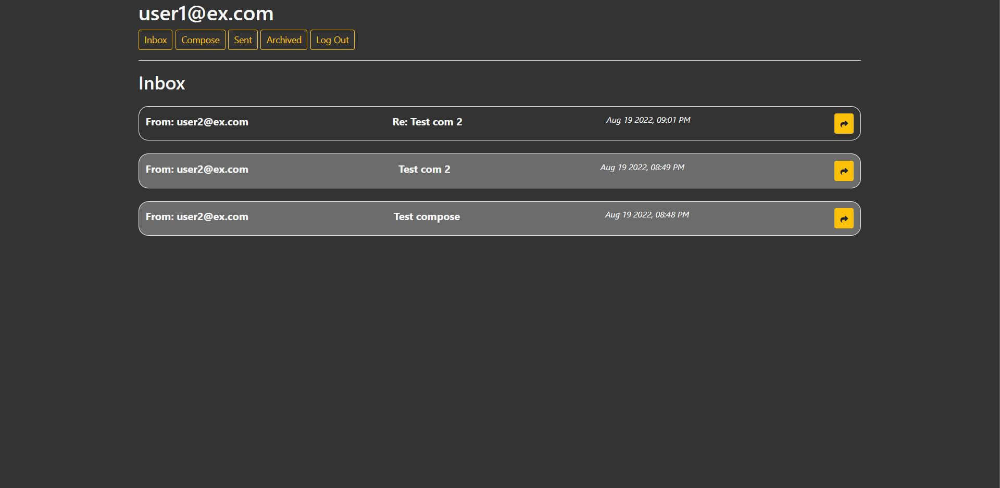
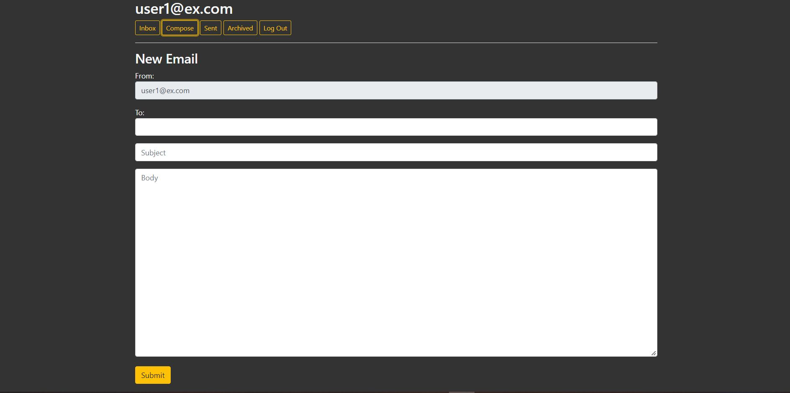

# CS50S-Mail

3rd Project of the CS50 Web.
A single page web application for sending and receiving emails using JavaScript fetch Api.
check it out [here](https://cs50.harvard.edu/web/2020/projects/3/mail/#specification).
Here's a [preview](https://www.youtube.com/watch?v=jPlfs-W37cM).

# Features
- Mailbox
- Send Mail
- View Email
- Archive and Unarchive
- Reply

# Setup

First, clone this repository:

```
git clone https://github.com/AhmedBedeir/cs50w-mail.git
cd cs50w-mail
```
Install dependencies:
```
pip install -r requirements.txt
```
To run server:
```
python manage.py runserver
```
Open http://localhost:8000 to view it in the browser.

# screenshots



# Author
[Ahmed Bedeir](https://www.linkedin.com/in/ahmed-bedeir-45b0171bb/)
